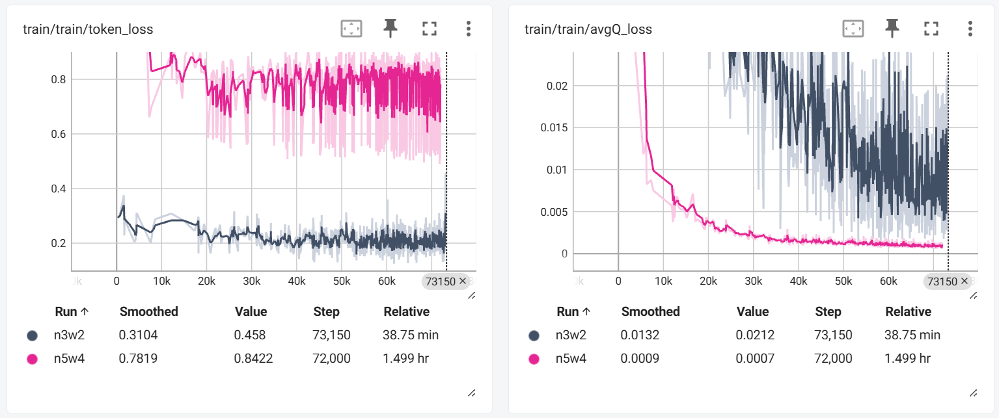

# Longshot LLM

A reinforcement learning framework for boolean formula generation and optimization using MAP-Elites and transformer-based models.

## Overview

Longshot LLM combines evolutionary algorithms with deep learning to discover and optimize boolean formulas. The system uses MAP-Elites for diversity-preserving optimization and GPT-2 based models for trajectory generation, where trajectories represent sequences of operations that construct boolean formulas.


*Training curves showing token loss and avgQ loss convergence for different model configurations (n3w2 and n5w4)*

## Features

- **MAP-Elites Algorithm**: Evolutionary optimization maintaining diverse archives of high-performing solutions
- **Neural Trajectory Generation**: GPT-2 based models trained to generate formula construction sequences
- **Distributed Execution**: Support for multi-instance synchronization via warehouse service
- **High-Performance Core**: C++/Python hybrid implementation for efficient formula operations
- **Comprehensive Evaluation**: Built-in metrics for avgQ analysis and trajectory quality assessment

## Installation

### Prerequisites

- Python 3.10+
- C++ compiler (for building the core extension)
- PyTorch
- Transformers (HuggingFace)
- MongoDB (required for warehouse service)

### Setup

1. Clone the repository:
```bash
git clone https://github.com/yourusername/longshot-llm.git
cd longshot-llm
```

2. Set up MongoDB:

   **Option A: Using Docker Compose (Recommended)**
   ```bash
   cd service
   docker-compose up -d
   cd ..
   ```
   This will start:
   - MongoDB on port 27017
   - Mongo Express web UI on port 8081 (optional admin interface)

   **Option B: Using External MongoDB**

   If you have your own MongoDB instance, update the connection string in `service/warehouse/main.py`:
   ```python
   mongo_client = MongoClient("your_mongodb_connection_string")
   ```

3. Install the core library:
```bash
cd library
pip install -e .
cd ..
```

4. Install service dependencies:
```bash
pip install -r service/clusterbomb/requirements.txt
# For warehouse service:
pip install pymongo fastapi uvicorn
```

## Quick Start

### Starting the Warehouse Service

The warehouse service must be running for trajectory storage and synchronization:

```bash
cd service/warehouse
python main.py
```

The warehouse API will be available at `http://localhost:8000`. You can check its health at `http://localhost:8000/health`.

### Running MAP-Elites

With the warehouse service running, you can start the MAP-Elites algorithm:

```bash
cd service/clusterbomb
python run_map_elites.py --iterations 100 --num-vars 4 --width 3
```

For distributed execution with synchronization:
```bash
python run_map_elites.py --enable-sync --sync-interval 10 --warehouse-host localhost
```

### Training a Model

Train a GPT-2 based model on trajectory data:

```bash
cd service/trainer
python train.py
```

The training script will:
- Load trajectory data from `./data/n{num_vars}w{width}.json`
- Train a GPT-2 model to predict next gates in trajectories
- Save checkpoints to `./output/` and final model to `./models/`

### Evaluating Models

Evaluate a trained model's performance:

```bash
python eval.py --model-path ./models/n3w2-2025-09-13T17:04:40
```

## Project Structure

```
longshot-llm/
├── library/              # Core C++/Python library
│   └── longshot/        # Main package
│       ├── _core.so     # C++ extension module
│       ├── formula/     # Formula operations
│       ├── utils/       # Utilities and helpers
│       └── service/     # Service layer
├── service/             # Microservices
│   ├── clusterbomb/     # MAP-Elites implementation
│   ├── trainer/         # Model training service
│   └── warehouse/       # Trajectory storage service
├── test/                # Test suites
├── script/              # Utility scripts
└── doc/                 # Documentation
```

## Key Concepts

### Trajectories
Sequences of gate operations that incrementally build boolean formulas. Each gate is encoded as an integer combining the operation type and variable indices.

### Elites
High-performing trajectories stored in the MAP-Elites archive. Each elite has:
- A trajectory (sequence of gates)
- Performance score (avgQ value)
- Behavioral features (computed via isodegrees)

### MAP-Elites Archive
A grid-based archive that maintains diverse solutions across a behavioral feature space. Each cell stores the best performing elite(s) for that region of the feature space.

### avgQ Metric
A quality metric for boolean formulas that measures their average satisfaction over all possible variable assignments.

## Testing

Run the test suite with pytest:

```bash
# Run all tests for MAP-Elites
python -m pytest test/test_map_elites.py -v

# Run specific test class
python -m pytest test/test_map_elites.py::TestFormulaIsodegrees -v

# Run single test
python -m pytest test/test_map_elites.py::TestTrajectoryGenerator::test_run_mutations_sync -v
```

## Configuration

### MAP-Elites Parameters

- `--iterations`: Number of evolution iterations
- `--num-vars`: Number of boolean variables
- `--width`: Maximum formula width
- `--cell-density`: Maximum elites per archive cell
- `--num-workers`: Parallel worker processes
- `--batch-size`: Elites to mutate per iteration

### Training Parameters

Configure training in `service/trainer/train.py`:
- Model architecture (layers, heads, embedding dimensions)
- Training hyperparameters (learning rate, batch size, epochs)
- Data augmentation (permutation settings)

## Utilities

### Export Trajectories

Export trajectory datasets from the warehouse service to JSON format for offline analysis or training.

```bash
# Export all trajectories to a JSON file
python script/export_trajectories.py --output trajectories.json

# Export trajectories with specific parameters
python script/export_trajectories.py --output data.json --num-vars 4 --width 3

# Export from remote warehouse with date filtering
python script/export_trajectories.py \
    --output filtered_data.json \
    --host remote.server \
    --port 8080 \
    --since 2024-01-01 \
    --until 2024-12-31

# Include metadata and pretty-print output
python script/export_trajectories.py \
    --output detailed.json \
    --include-metadata \
    --pretty \
    --verbose
```

**Options:**
- `--output, -o`: Output JSON file path (required)
- `--num-vars`: Filter by number of variables
- `--width`: Filter by formula width
- `--host`: Warehouse host (default: localhost)
- `--port`: Warehouse port (default: 8000)
- `--since`: Filter trajectories after this date (ISO format)
- `--until`: Filter trajectories before this date (ISO format)
- `--include-metadata`: Include traj_id, num_vars, width in output
- `--pretty`: Pretty-print JSON output (increases file size)
- `--verbose`: Enable verbose logging

**Output Format:**
```json
{
  "trajectories": [
    {
      "traj_id": "uuid-string",
      "num_vars": 4,
      "width": 3,
      "steps": [
        [type, literals, avgQ],
        ...
      ]
    }
  ]
}
```

### Analyze avgQ Distribution

Generate statistical analysis and visualizations of avgQ distributions from trajectory data.

```bash
# Analyze from local JSON file
python script/avgq_distribution.py --file data/n4w3.json

# Download and analyze from warehouse
python script/avgq_distribution.py \
    --warehouse \
    --num-vars 4 \
    --width 3 \
    --output-dir plots/

# Analyze from remote warehouse with custom settings
python script/avgq_distribution.py \
    --warehouse \
    --host analytics.server \
    --port 8080 \
    --num-vars 5 \
    --width 4 \
    --timeout 60 \
    --output-dir analysis/
```

**Options:**
- `--file`: Path to local JSON file containing trajectories
- `--warehouse`: Download trajectories from warehouse service
- `--num-vars`: Filter by number of variables
- `--width`: Filter by formula width
- `--host`: Warehouse host (default: localhost)
- `--port`: Warehouse port (default: 8000)
- `--timeout`: Request timeout in seconds (default: 30)
- `--output-dir`: Directory to save plots (default: current directory)

**Output:**
- Generates PNG plots showing:
  - avgQ distribution across all trajectories
  - avgQ distribution at step level
  - Statistical summaries (mean, std, min, max)
- Files saved as `n{num_vars}w{width}_avgQ_distr.png`

### Show Formula Details

Display human-readable formula representation from a trajectory at a specific point.

```bash
# Show formula at step 42 of a trajectory
python script/show_formula.py --traj abc123-def456 42

# Display formula from remote warehouse
python script/show_formula.py \
    --traj trajectory_id 127 \
    --host remote.server \
    --port 8080

# Show final formula (use large slice number)
python script/show_formula.py --traj xyz789 9999
```

**Arguments:**
- `--traj`: Trajectory ID (required)
- `slice`: Step index to display formula at (required)
- `--host`: Warehouse host (default: localhost)
- `--port`: Warehouse port (default: 8000)

**Output:**
- Trajectory metadata (num_vars, width)
- Formula reconstruction up to specified step
- Token statistics (ADD, DEL, EOS counts)
- Formula representation in human-readable format
- Variables used and gate count

**Example Output:**
```
Trajectory: abc123-def456
Parameters: num_vars=4, width=3
Slice: 42/150 steps

Formula at step 42:
  Gate 1: AND(x1, x2, ¬x3)
  Gate 2: OR(x2, x4)
  Gate 3: AND(Gate1, Gate2)

Statistics:
  Total gates: 3
  Variables used: {1, 2, 3, 4}
  ADD tokens: 35
  DEL tokens: 5
  EOS tokens: 2
  avgQ at step 42: 0.67
```

## Development

### Component Documentation

For detailed documentation about each component, please refer to the specific README files:

**Core Library:**
- **Longshot Library**: [`library/README.md`](library/README.md) - Core C++/Python library for formula manipulation

**Services:**
- **Clusterbomb Service**: [`service/clusterbomb/README.md`](service/clusterbomb/README.md) - MAP-Elites algorithm implementation
- **Trainer Service**: [`service/trainer/README.md`](service/trainer/README.md) - Neural network training pipeline
- **Warehouse Service**: [`service/warehouse/`](service/warehouse/) - Trajectory storage and retrieval

### API Documentation

The `/doc` directory contains comprehensive Sphinx-based documentation for the entire project, including:

- **API Reference**: Complete API documentation for all modules and classes
- **Module Guides**: Detailed explanations of each component
- **Code Examples**: Practical usage examples and tutorials
- **Architecture Overview**: System design and interaction diagrams

#### Building the Documentation

Generate the HTML documentation:

```bash
cd doc
make html
```

The generated documentation will be available at `doc/_build/html/index.html`. Open this file in a web browser to browse the complete documentation.

#### Documentation Structure

```
doc/
├── conf.py              # Sphinx configuration
├── index.rst            # Main documentation entry point
├── modules.rst          # API module index
├── _static/             # Static assets (CSS, images)
├── _templates/          # Custom templates
└── _build/              # Generated documentation (after building)
    └── html/
        └── index.html   # Main documentation page
```

### Adding New Features

1. **New Gate Types**: Extend the gate encoding in `longshot/utils`
2. **New Behavioral Features**: Modify `FormulaIsodegrees` in `service/clusterbomb/isodegrees.py`
3. **New Selection Strategies**: Add to `MAPElitesService` in `service/clusterbomb/map_elites_service.py`

## Architecture

The system follows a microservices architecture:

- **Core Library**: High-performance formula operations (C++/Python)
- **MAP-Elites Service**: Evolutionary optimization engine
- **Training Service**: Neural network training pipeline
- **Warehouse Service**: Centralized trajectory storage

Services communicate asynchronously for scalability and can be deployed independently.

## License

This project is licensed under the GNU General Public License v3.0 - see the [LICENSE](LICENSE) file for details.

## Citation

```bibtex
@software{longshot_llm,
  title = {Longshot LLM: Boolean Formula Generation with MAP-Elites and Transformers},
  author = {bluebread},
  year = {2024},
  url = {https://github.com/bluebread/longshot-llm}
}
```
